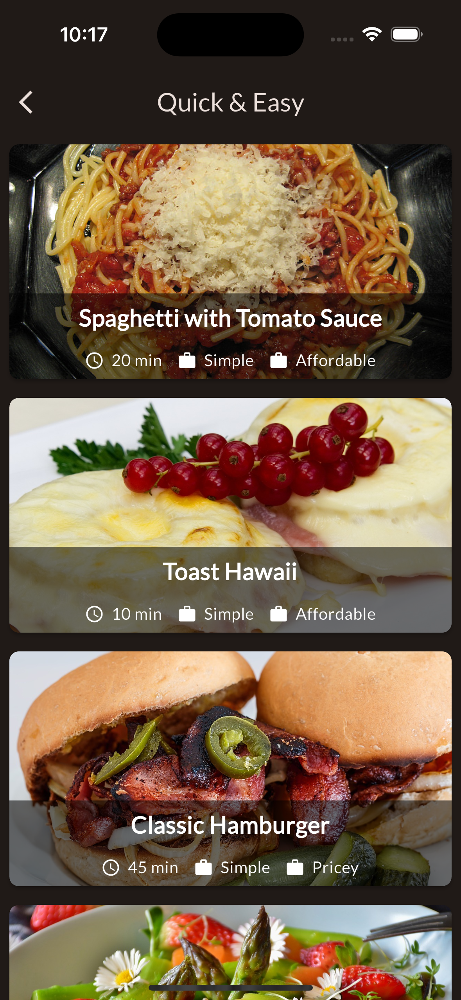

# Meals_App
# What is covered in this project 
- Dummy Data for Meals and Categories 
- Gridview for the List of Categories
- Stack Wdiget User
- Tab Based Navigation 
- Side Drawer Usage in the project
- Filtering the list of data and displaying
- Riverpod State Management Use
- Provider Use 
- Using Notifier
- Animations for loading and other features of the app
- ThemeData for the dark and light mode of the app


```dart
import 'package:flutter_riverpod/flutter_riverpod.dart';
import 'package:meals/providers/favorites_provider.dart';
import 'package:meals/providers/filters_provider.dart';

  final activeFilters = ref.watch(filtersProvider);
```

## Explicit Animations
- You can control the entire animation
- More control but also more complexity
- Can often be avoided (by using pre-built Widgets)

### Implicit Animations
- Flutter controls the animation
- Less control and therefore less complexity
- Use pre-built animation widgets as often as possible

```dart
       Hero(tag: meal.id,
              child: FadeInImage(
                placeholder: MemoryImage(kTransparentImage),
                image: NetworkImage(meal.imageUrl),
                height: 200,
                width: double.infinity,
                fit: BoxFit.cover,
              ),
            ),
```

### Screenshot Examples of the project

# Categories 


# Meals


# Meals Detail Page 


# Favorites Page 


# Side Drawer 


# Filters Page 


